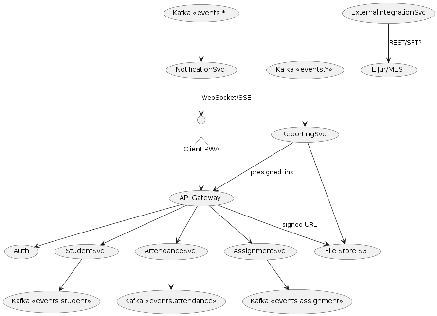

# Домашка 2: Интеграции

## 1. Вводные

**Источник требований:** функциональные (FR‑01 … FR‑07) и нефункциональные разделы HW‑1 «Architectural Kata: Tales Of A Fourth Grade», апрель 2025.
**Цель:** определить сервисы MVP, выбрать типы интеграций, обосновать выбор и представить верхнеуровневую HLD‑схему.

---

## 2. Микросервисы MVP

| Код      | Сервис               | Задачи                                                                                  | Собственная БД   |
| -------- | -------------------- | --------------------------------------------------------------------------------------- | ---------------- |
| **GATE** | **API Gateway**      | Единая точка входа для клиентов, маршрутизация, rate‑limit, HTTPS‑TLS termination       | —                |
| **AUTH** | Auth & IAM           | Регистрация, вход, JWT/OAuth 2.1, refresh‑токены, RBAC («учитель», «родитель», «админ») | ✔                |
| **STUD** | Student Service      | CRUD профиля ученика + статические справочники (класс, школа)                           | ✔                |
| **ATTN** | Attendance Service   | Учёт посещаемости, опозданий, заявлений **Excuse**                                      | ✔                |
| **ASGN** | Assignment Service   | Создание заданий, приём решений, хранение оценок                                        | ✔                |
| **RPT**  | Reporting Service    | Сбор данных из STUD/ATTN/ASGN, генерация PDF/HTML                                       | — (read‑replica) |
| **NTFY** | Notification Service | Отправка push/WebSocket/SSE, e‑mail, SMS; декларативные шаблоны                         | —                |
| **FILE** | File Store           | S3‑совместимое хранилище для сканов справок и отчётов                                   | S3‑bucket        |
| **INTG** | External Integration | Коннекторы к «ЭлЖур/МЭШ» и др.; сохранено в риск‑листе (future)                         | —                |

> **Причина выделения:** каждое ограничение из НФТ (масштаб 1 млн учеников, p99 ≤ 200 мс на чтение, ФЗ‑152) локализуется внутри сервиса; упрощается горизонтальное масштабирование (шардинг по школе).

---

## 3. Интеграции и выбор способа взаимодействия

| № | Откуда → Куда                   | Тип канала     | Технология               | Обоснование (НФТ, SLA)                                                                                      |
| - | ------------------------------- | -------------- | ------------------------ | ----------------------------------------------------------------------------------------------------------- |
| 1 | **Client PWA** → **GATE**       | *sync*         | HTTPS REST/GraphQL       | Нужен немедленный ответ <200 мс p99 для UX.                                                                 |
| 2 | **GATE** → **AUTH**             | *sync*         | REST + JWT in header     | Контролируем доступ сразу, иначе — 401.                                                                     |
| 3 | **GATE** → **STUD/ATTN/ASGN**   | *sync*         | REST                     | CRUD‑операции, типичные 2‑копейка‑транзакции.                                                               |
| 4 | **STUD/ATTN/ASGN** → **RPT** | *async* | Kafka topic «events.*» | Генерация отчётов не блокирует запись, выдерживает всплески; гарантированная доставка |
| 5 | **ASGN** → **NTFY**             | *async*        | Kafka + DLQ              | После выставления оценки отправляем уведомление; отсутствие задержек < 1 сек важнее, чем консистентность.   |
| 6 | **NTFY** → **Client PWA**       | *async*        | WebSocket/SSE            | Реал‑тайм колокольчик, не держим длинных HTTP‑пулаев.                                                       |
| 7 | **GATE** → **FILE**             | *sync*         | S3 signed‑URLs           | Загрузка/скачивание файлов сканов.                                                                          |
| 8 | **INTG** ⇄ **External systems** | *sync + batch* | REST/CSV‑batch over SFTP | Зависит от возможностей сторон; изолировано в отдельный сервис.                                             |

### Обоснование выбора каналов

* **Синхронный REST** оставляем там, где клиенту необходим мгновенный ответ или операция должна завершиться атомарно (например, «подать заявление»).
* **Асинхронный Kafka** выбираем для фан‑аут потоков событий, когда 1️⃣ требуется гарантированная доставка (DLQ), 2️⃣ отчёты и уведомления могут формироваться позже, 3️⃣ нагрузка — всплески до 15 000 RPS.
* **WebSocket/SSE** — низкий overhead, подходит для push‑уведомлений родителям/учителям.
* **Signed URL** разгружает backend при работе с большими файлами, соответствует НФТ «p99 ≤ 500 мс на запись».

---

## 4. Верхнеуровневая HLD‑схема

### Текстовое описание

1. **Клиент** (Vue PWA) общается с **API Gateway**.
2. Gateway валидирует JWT через **Auth** и маршрутизирует вызовы к бизнес‑сервисам (**STUD**, **ATTN**, **ASGN**).
3. Бизнес‑сервисы публикуют доменные события в **Kafka**.
4. **Reporting** и **Notification** подписываются на события:

   * Reporting аггрегирует данные и кладёт PDF в **File Store**; ссылка летит обратно клиенту.
   * Notification пушит в WebSocket hub и внешний e‑mail/SMS‑шлюз.
5. **File Store** отдает/принимает файлы напрямую по signed URL.
6. **External Integration** периодически обменивается данными с другими госсистемами.

### PlantUML




```


