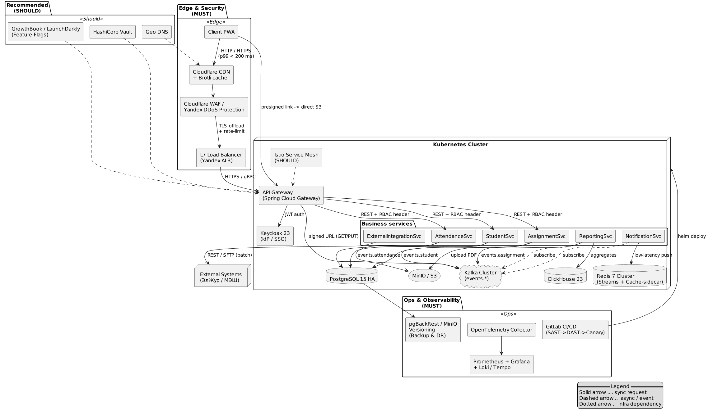

# Домашка 4: Дополнительные компоненты HLD

## 1. Обязательные компоненты (MUST)

| Компонент                                  | Обоснование                                                                                                   | Реализация                                            |
| ------------------------------------------ | ------------------------------------------------------------------------------------------------------------- | ------------------------------------------------------------------------ |
| **Load Balancer (L7)**                     | Горизонтальное масштабирование всех stateless‑сервисов; health‑checks, TLS‑offload.                           | *Yandex Application Load Balancer* (HTTP, gRPC)                          |
| **WAF / Anti‑DDoS**                        | Защита от OWASP Top 10, rate‑limiting атак на публичные сервисы школы.                                        | *Cloudflare WAF* + *Yandex DDoS Protection*                              |
| **IdP / SSO**                              | Централизованная аутентификация (OAuth 2.1/OIDC), 2FA для учителей; выполняет требования ФЗ‑152.              | *Keycloak 23* (HA‑кластер в Kubernetes)                                  |
| **CDN**                                    | Отдача статических ассетов (Vue PWA, PDF‑отчёты) ближайшим edge‑узлом → уменьшение p99 < 200 мс для регионов. | *Cloudflare CDN* + S3‑origin (MinIO)                                     |
| **Кэш слоя (Side‑car)**                    | Снижение нагрузки на PostgreSQL + Redis Streams при повторном чтении «горячих» данных (ученик, расписание).   | *Redis 7* (Cluster) в режиме `cache-aside`, TTL = 30 с                   |
| **CI/CD pipeline**                         | Быстрый и безопасный rollout; quality‑gates (SAST, DAST) → снижает time‑to‑market и человеческий фактор.      | *GitLab CI* → Build → Unit → SAST → Container scan → Canary deploy (K8s) |
| **Наблюдаемость (лог + метрики + трейсы)** | SLA 99.9 % требует проактивного мониторинга и быстрой RCA.                                                    | *OpenTelemetry Collector* → Prometheus, Loki, Tempo, Grafana             |
| **Резервное копирование**                  | RPO < 1 мин (152‑ФЗ) для БД: PITR + off‑site snaps.                                                           | `pgBackRest` + S3 Glacier, MinIO Versioning, ClickHouse `backup`         |

## 2. Рекомендуемые компоненты (SHOULD)

| Компонент                     | Обоснование                                                                          | Реализация (опционально)            |
| ----------------------------- | ------------------------------------------------------------------------------------ | ----------------------------------- |
| **Service Mesh**              | Egress/ingress‑политики, retries, circuit‑breaking; полезно с 10+ микросервисами.    | *Istio* на K8s → Envoy‑Sidecar      |
| **Geo DNS**                   | Маршрутизация пользователей к ближайшему DC (Москва ↔ СПБ) при future active‑active. | *Yandex GeoDNS*                     |
| **Feature Flags**             | Безопасный rollout, A/B тесты для родителей.                                         | *GrowthBook* OSS или *LaunchDarkly* |
| **Secrets Vault**             | Centralized secret mgmt (DB creds, API keys).                                        | *HashiCorp Vault* → K8s CSI         |
| **Quality Gates (SAST/DAST)** | Автоматический security scan, выполняет DevSecOps «shift‑left».                      | *GitLab Ultimate* scans             |

## 3. Обновлённая HLD (PlantUML)

## 4. Итог

В систему внесены обязательные (MUST) и рекомендованные (SHOULD) компоненты, их ценность подтверждена НФТ: латентность, безопасность, HA и DevOps‑быстрота.
